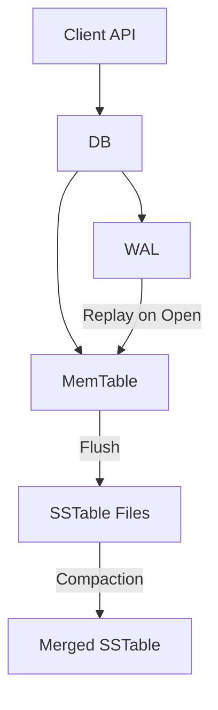

# kv-store-demo

## 项目简介

`kv-store-demo` 是一个使用 Go 实现的单机 KV 存储引擎学习项目。

项目采用 LSM Tree 的核心思路，目标不是实现一个生产级数据库，而是通过一个足够小、足够清晰的 Demo，帮助理解现代 KV 存储引擎中的几个关键概念。

## 项目目标

本项目用于学习和验证以下内容：

- KV 存储引擎的基本使用方式
- WAL 预写日志
- MemTable 内存表
- SSTable 有序不可变文件
- Flush 机制
- Compaction 机制
- 数据关闭后重新打开的恢复流程

## 功能特性

计划第一版支持：

- `Put` 写入 key/value
- `Get` 读取 key/value
- `Delete` 删除 key
- WAL 持久化
- MemTable
- SSTable
- 手动 Flush
- 手动 Compaction
- Open 后恢复数据
- 通过 `example` 展示 API 使用

## 非目标

本项目暂不追求以下能力：

- 生产级可靠性
- 完整 RocksDB 兼容
- 分布式存储
- 事务
- 网络服务
- 高并发优化
- 后台自动 Compaction
- Bloom Filter
- Block Cache
- 多层 Level Compaction

## 架构概览



## 快速开始

当前项目处于骨架阶段，可以先运行测试确认模块接口可编译。

```bash
go test ./...
```

第一版实现完成后，会通过 `example` 目录提供 API 使用示例。

## API 示例片段

下面是 API 使用片段，用于展示第一版完成后的调用方式。完整可运行示例会在实现完成后放到 `example/main.go`。

```go
import kv "kv_store_demo"

db, err := kv.Open(kv.Options{
    Dir:          "./data",
    MemTableSize: 1024,
})
if err != nil {
    panic(err)
}
defer db.Close()

if err := db.Put([]byte("name"), []byte("alice")); err != nil {
    panic(err)
}

value, err := db.Get([]byte("name"))
if err != nil {
    panic(err)
}
```

## 项目结构

计划中的第一版结构：

```text
.
├── db.go              # 对外 API 和整体协调
├── options.go         # 配置项
├── errors.go          # 公共错误
├── internal/
│   ├── record/        # 记录类型和编码
│   ├── memtable/      # 内存表
│   ├── wal/           # 预写日志
│   ├── sstable/       # 有序不可变文件
│   └── compact/       # SSTable 合并
├── test/
│   └── db_test.go     # API 形状测试
├── docs/
│   └── design.md  # 设计文档
└── example/        # 实现完成后放置 API 使用示例
```

## 学习路线

推荐后续阅读代码时按以下顺序：

```text
1. internal/record/record.go
2. internal/memtable/memtable.go
3. internal/wal/wal.go
4. internal/sstable/sstable.go
5. db.go
6. internal/compact/compact.go
7. example/main.go（实现完成后创建）
```

## 设计简化

为了让项目更适合作为学习 Demo，第一版会刻意做一些简化：

- MemTable 使用 `map`，而不是 SkipList
- Flush 时对 key 排序后写入 SSTable
- SSTable 启动时扫描文件建立内存索引
- Compaction 合并所有 SSTable，而不是实现多层 Level
- WAL 不实现 checksum
- 不引入后台线程

## 后续计划

后续可以逐步扩展：

- SkipList MemTable
- SSTable 稀疏索引
- Bloom Filter
- Manifest 元数据文件
- WAL segment
- 分层 Compaction
- Benchmark
- HTTP API
