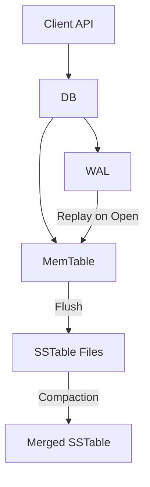

# kv-store-demo

## 项目简介

`kv-store-demo` 是一个使用 Go 实现的 KV 存储系统学习项目。

项目从单机 LSM Tree 存储引擎开始，逐步演进到分布式 KV 存储系统。目标不是实现一个生产级数据库，而是通过足够小、足够清晰的 Demo，帮助理解现代 KV 存储系统中的核心概念。

## 项目目标

本项目用于学习和验证以下内容：

- KV 存储引擎的基本使用方式
- WAL 预写日志
- MemTable 内存表
- SSTable 有序不可变文件
- Flush 机制
- Compaction 机制
- 数据关闭后重新打开的恢复流程
- gRPC 服务化
- Raft 复制一致性
- 一致性哈希和数据分片

## 功能特性

第一版已经支持：

- `Put` 写入 key/value
- `Get` 读取 key/value
- `Delete` 删除 key
- WAL 持久化
- MemTable
- SSTable
- 手动 Flush
- 手动 Compaction
- Open 后恢复数据
- 通过 `example` 展示 API 使用

## V1.0 版本

`v1.0` 是本项目的第一个完整学习版，实现了单机 LSM Tree KV 存储引擎的主干流程：

- 写入路径：`Put` / `Delete` 先写 WAL，再更新 MemTable。
- 读取路径：`Get` 按 MemTable、最新 SSTable 到旧 SSTable 的顺序查找。
- 持久化路径：MemTable 可手动或自动 Flush 为有序 SSTable，并在 Flush 后 reset WAL。
- 恢复路径：`Open` 加载已有 SSTable，并 replay WAL 恢复未 Flush 的数据。
- 整理路径：`Compact` 合并所有 SSTable，保留同 key 最新版本并清理 tombstone。
- 示例路径：`go run ./example` 展示写入、读取、删除、Flush、重启恢复和 Compaction。

## V2.0 分布式演进

`v2.0` 从当前单机引擎出发，按阶段演进为分布式 KV 系统。推荐路线：

```text
1. gRPC 单节点服务
2. HashiCorp Raft 单复制组
3. 一致性哈希静态分片
4. 多 shard group，每个 shard group 一个 Raft 复制组
```

第一阶段只把当前 `kv.DB` 暴露为 gRPC 服务；第二阶段使用 `github.com/hashicorp/raft` 把写入变成 Raft commit 后再 apply；第三阶段引入一致性哈希和静态 shard 配置，让请求路径经过 `key -> shard -> group` 路由；第四阶段扩展为真正的多 shard group。

详细路线见 `docs/distributed.md` 和 `docs/agent/roadmap.md`。

## 非目标

本项目暂不追求以下能力：

- 生产级可靠性
- 完整 RocksDB 兼容
- 事务
- 高并发优化
- 后台自动 Compaction
- Bloom Filter
- Block Cache
- 多层 Level Compaction
- 自动扩缩容和在线数据迁移
- 复杂 SQL / 事务模型

## 架构概览



## 快速开始

运行测试确认当前实现：

```bash
go test ./...
```

运行完整 API 示例：

```bash
go run ./example
```

运行 gRPC 单节点服务示例：

```bash
go run ./cmd/kv-node --addr 127.0.0.1:9001 --dir /tmp/kv_store_demo/grpc_node
```

在另一个终端运行 gRPC 客户端示例：

```bash
go run ./example/grpc --addr 127.0.0.1:9001
```

运行三节点分布式示例：

```bash
go run ./example/distributed --requests 200
```

该示例会自动生成两组 shard group 的三节点配置，启动三个 `kv-node` 进程，通过 `RoutedClient` 做批量写入和读取性能统计，然后停止节点并离线打开每个副本的本地 DB，校验多节点数据一致性。

运行并发混合读写压测示例：

```bash
go run ./example/distributed --requests 100000 --concurrency 32 --value-size 1024 --read-ratio 80 --report /tmp/kv_store_demo_report.json
```

功能与性能压测计划见 `docs/distributed-test-plan.md`。

运行 Raft 三节点示例，先准备 `cluster.json`：

```json
{
	"nodes": [
	  {
	    "id": "n1",
	    "client_addr": "127.0.0.1:9001"
	  },
	  {
	    "id": "n2",
	    "client_addr": "127.0.0.1:9002"
	  },
	  {
	    "id": "n3",
	    "client_addr": "127.0.0.1:9003"
	  }
	],
	"shard_config": {
	  "shard_count": 4,
	  "virtual_nodes": 8
	},
	"shards": [
	  {
	    "id": 0,
	    "group_id": "g1"
	  },
	  {
	    "id": 1,
	    "group_id": "g1"
	  },
	  {
	    "id": 2,
	    "group_id": "g1"
	  },
	  {
	    "id": 3,
	    "group_id": "g1"
	  }
	],
	"groups": [
	  {
	    "id": "g1",
	    "replicas": [
	      {
	        "node_id": "n1",
	        "raft_addr": "127.0.0.1:10001"
	      },
	      {
	        "node_id": "n2",
	        "raft_addr": "127.0.0.1:10002"
	      },
	      {
	        "node_id": "n3",
	        "raft_addr": "127.0.0.1:10003"
	      }
	    ]
	  }
	]
}
```

分别启动三个节点：

```bash
go run ./cmd/kv-node --mode raft --node-id n1 --cluster ./cluster.json --bootstrap --dir /tmp/kv_store_demo/n1
go run ./cmd/kv-node --mode raft --node-id n2 --cluster ./cluster.json --dir /tmp/kv_store_demo/n2
go run ./cmd/kv-node --mode raft --node-id n3 --cluster ./cluster.json --dir /tmp/kv_store_demo/n3
```

`--bootstrap` 只用于初始化新 Raft 集群；已有 Raft state 时会跳过重复 bootstrap。raft 模式下本地目录会拆成 `engine/` 和 `raft/`。

如果要启用多 group 静态分片路由，可以在同一个 `cluster.json` 中配置多个 `groups`：

```json
{
	"nodes": [
	  {
	    "id": "n1",
	    "client_addr": "127.0.0.1:9001"
	  },
	  {
	    "id": "n2",
	    "client_addr": "127.0.0.1:9002"
	  },
	  {
	    "id": "n3",
	    "client_addr": "127.0.0.1:9003"
	  }
	],
  "shard_config": {
    "shard_count": 4,
    "virtual_nodes": 8
  },
  "shards": [
    {
      "id": 0,
      "group_id": "g1"
    },
    {
      "id": 1,
      "group_id": "g1"
    },
    {
      "id": 2,
      "group_id": "g2"
    },
	  {
	    "id": 3,
	    "group_id": "g2"
	  }
	],
	"groups": [
	  {
	    "id": "g1",
	    "replicas": [
	      {
	        "node_id": "n1",
	        "raft_addr": "127.0.0.1:11001"
	      },
	      {
	        "node_id": "n2",
	        "raft_addr": "127.0.0.1:11002"
	      },
	      {
	        "node_id": "n3",
	        "raft_addr": "127.0.0.1:11003"
	      }
	    ]
	  },
	  {
	    "id": "g2",
	    "replicas": [
	      {
	        "node_id": "n1",
	        "raft_addr": "127.0.0.1:12001"
	      },
	      {
	        "node_id": "n2",
	        "raft_addr": "127.0.0.1:12002"
	      },
	      {
	        "node_id": "n3",
	        "raft_addr": "127.0.0.1:12003"
	      }
	    ]
	  }
	]
}
```

当前 `kv-node` 会为本节点参与的每个 group 创建独立的本地 engine、Raft 数据目录、`kv.DB`、Raft node 和 RaftStore；三节点多 group 端到端路径已由测试覆盖。

多 group 模式下，请求主路径是：

```text
client
-> gRPC
-> ShardStore
-> key -> shardID -> groupID
-> 对应 group 的 RaftStore
-> 对应 group 的 Raft log / FSM
-> 对应 group 的本地 kv.DB
```

## API 示例片段

下面是 API 使用片段。完整可运行示例见 `example/simple_example.go`。

```go
import kv "kv_store_demo"

db, err := kv.Open(kv.Options{
    Dir:          "./data",
    MemTableSize: 1024,
})
if err != nil {
    panic(err)
}
defer db.Close()

if err := db.Put([]byte("name"), []byte("alice")); err != nil {
    panic(err)
}

value, err := db.Get([]byte("name"))
if err != nil {
    panic(err)
}
```

## 项目结构

当前第一版结构：

```text
.
├── api/kv/v1/        # gRPC proto 定义
├── cmd/kv-node/      # gRPC 单节点服务入口
├── db.go              # 对外 API 和整体协调
├── options.go         # 配置项
├── errors.go          # 对外错误别名
├── gen/kv/v1/        # protobuf / gRPC 生成代码
├── internal/
│   ├── engine/        # 单机 LSM 引擎内部组件
│   │   ├── record/    # 记录类型和编码
│   │   ├── memtable/  # 内存表
│   │   ├── wal/       # 预写日志
│   │   ├── sstable/   # 有序不可变文件
│   │   └── compact/   # SSTable 合并
│   ├── platform/      # 日志、文件工具和内部错误
│   ├── raft/          # HashiCorp Raft 接入层
│   ├── shard/         # 一致性哈希、静态路由和 ShardStore
│   ├── server/grpc/   # gRPC server 适配层
│   └── client/        # gRPC client 封装
├── test/
│   ├── db_test.go     # 单机 API 集成测试
│   ├── grpc_test.go   # gRPC 端到端集成测试
│   └── raft_grpc_test.go # Raft/gRPC/ShardStore 端到端集成测试
├── docs/
│   ├── design.md       # 单机引擎设计文档
│   └── distributed.md  # v2 分布式演进设计文档
└── example/
    ├── simple_example.go # API 使用示例
    └── grpc/             # gRPC 客户端示例
```

## 学习路线

推荐后续阅读代码时按以下顺序：

```text
1. internal/engine/record/record.go
2. internal/engine/memtable/memtable.go
3. internal/engine/wal/wal.go
4. internal/engine/sstable/sstable.go
5. db.go
6. internal/engine/compact/compact.go
7. example/simple_example.go
```

## 设计简化

为了让项目更适合作为学习 Demo，第一版会刻意做一些简化：

- MemTable 使用 `map`，而不是 SkipList
- Flush 时对 key 排序后写入 SSTable
- SSTable 启动时扫描文件建立内存索引
- Compaction 合并所有 SSTable，使用 iterator + 堆做流式归并，而不是实现多层 Level
- WAL 不实现 checksum
- 不引入后台线程

## 后续计划

单机引擎方向可以逐步扩展：

- SkipList MemTable
- SSTable 稀疏索引
- Bloom Filter
- Manifest 元数据文件
- WAL segment
- 分层 Compaction
- Benchmark

v2 分布式主线当前已完成到多 shard group 学习版：

- gRPC 单节点服务
- HashiCorp Raft 单复制组
- 一致性哈希静态分片
- 多 shard group 和分片路由

后续如果继续扩展，优先考虑：

- client 根据 key 和集群配置定位目标 group leader
- follower 或非目标 group 节点转发请求
- shard 迁移和 rebalance
- 动态 membership
